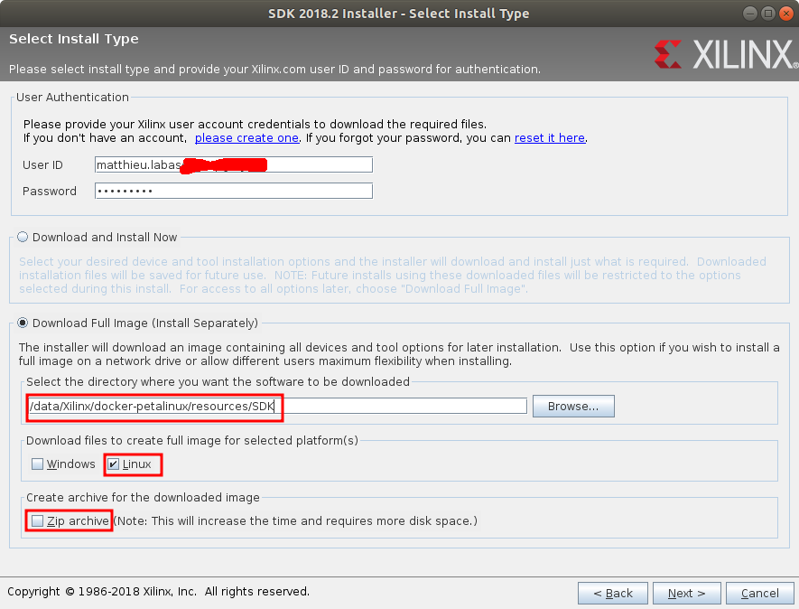

# Generic Petalinux Dockerfile

A somehow generic Xilinx PetaLinux+SDK docker file, using Ubuntu (though some tweaks might be possible for Windows).

It was successfully tested with version `2017.4` up to `2019.1`, *which is the last version handled by this release*.

**STARTING FROM 2019.2 THE SDK IS PART OF THE VITIS PLATFORM! It will be handled in future releases.**

> **Caution**: some modifications are to be performed on Xilinx files to make it compliant with unattended installation! Xilinx is supposed to provide better options starting from `2018.3`.

>Inspired by [docker-xilinx-petalinux-desktop](https://github.com/JamesAnthonyLow/docker-xilinx-petalinux-desktop) (and some of [petalinux-docker](https://github.com/xaljer/petalinux-docker)).

## Prepare installers

SDK and PetaLinux installers are to be downloaded from [Xilinx website](https://www.xilinx.com/support/download/index.html/content/xilinx/en/downloadNav/embedded-design-tools.html). They need to be prepared for unattended installation.

### SDK

You need to get the unattended-install-compliant SDK archive, linked to your Xilinx account:
1. Download the SDK installer `Xilinx_SDK_XXXX.X_YYYY_ZZZZ_Lin64.bin` (e.g. `Xilinx_SDK_2018.2_0614_1954_Lin64.bin`)
2. Run it
3. Click `Next >` to go to `Select install type` page
4. Enter your Xilinx user ID and password
5. Select `Download Full Image (Install Separately)`
6. Select `resources/SDK` directory for the download location
7. Select `Linux` for the `Download files to create full image for selected platform(s)`. **Do not select `Zip archive`!** It will mess up file attributes and the installer will fail:

8. Click `Next >`
9. Click `Download`
10. When the download is finished, go to `resource` and run `./package_SDK.sh`. It will get the SDK version from the `SDK` directory and package it for Docker build.

You can modify the `install_config_sdk.txt` to fine-tune the options, but the default is fine.

### PetaLinux

We need to patch the petalinux installer so it does not ask to accept licences.

> N.B. I'm not sure it's completely legal; but I haven't been able to script an `expect` to automatically accept them (which might not be legal as well anyway). So we'll consider your download means you accept those licences (which are available in the petalinux install directory)

In `resources`, run:

    ./patch_petalinux_installer.sh /path/to/petalinux-vXXX.X-final-installer.run

(that will patch the installer *in place*).

## Build the image

Run:

    ./docker_build.sh <VERSION>

> `<VERSION>` can be `2017.4`, `2018.2`, ...
> Corresponding petalinux and SDK files are expected to be found in `resources` directory.

The `docker_build.sh` will automatically spawn a simple HTTP server to serve the installers instead of copying them to the docker images (especially pushing them to the Docker daemon. Big space/time saver).

The image takes a long time to build (up to a couple hours, depending on disk space and system use), but should succeed.

It weighs around 33 GB.

### Parameters

Several arguments can be provided to customize the build, with `--build-arg`:

* `XILVER` for the Xilinx version to install. The `Dockerfile` expects to find `${HTTP_SERVER}/Xilinx-SDK-v${XILVER}.tgz` for the SDK installer (unless `SDK_INSTALLER` is given), and `${HTTP_SERVER}/petalinux-v${XILVER}-final-installer.run` for the PetaLinux installer (unless `PETALINUX_INSTALLER` is given).
 Defaults to `2018.2`.

* `SDK_INSTALLER` is the name of the SDK installer archive.
 Defaults to `Xilinx-SDK-v${XILVER}.tgz`

* `PETALINUX_BASE` is the name of the PetaLinux base. Petalinux will be installed in `/opt/${PETALINUX_BASE}` and the installer is expected to be sourced from `resources/${PETALINUX_BASE}-installer.run`.
 Defaults to `petalinux-v${XILVER}-final`.

* `PETALINUX_INSTALLER` is the PetaLinux installer file.
 Defaults to `${PETALINUX_BASE}-installer.run`

* `HTTP_SERV` is the HTTP server serving both SDK and PetaLinux installer.
 Defaults to `http://172.17.0.1:8000/resources`.

You can fully customize the installation by manually running e.g.:

    docker build . -t petalinux:2017.4 \
        --build-arg XILVER=2017.4 \
        --build-arg SDK_FILE=SDK/Xilinx_SDK_v2017.4-patched.tar.gz \
        --build-arg PETALINUX_INSTALLER=petalinux/petalinux-v2017.4-final-patched.run \
        --build-arg HTTP_SERV=https://local.company.com/dockers/petalinux/2017.4/resources

The SDK will be retrieved at `https://local.company.com/dockers/petalinux/2017.4/resources/SDK/Xilinx_SDK_v2017.4-patched.tar.gz` and petalinux at `https://local.company.com/dockers/petalinux/2017.4/resources/petalinux/petalinux-v2017.4-final-patched.run`

## Work with a PetaLinux project

A helper script `petalin.sh` is provided that should be run *inside* a petalinux project directory. It basically is a shortcut to:

    docker run -ti -v "$PWD":"$PWD" -w "$PWD" --rm -u petalinux petalinux:<latest version> $@

When run without arguments, a shell will spawn, *with PetaLinux and SDK `settings.sh` already sourced*, so you can directly execute `petalinux-*` commands.

    user@host:/path/to/petalinux_project$ /path/to/petalin.sh
    petalinux@a3ce6f8c:/path/to/petalinux_project$ petalinux-build

Otherwise, the arguments will be executed as a command.

> N.B. the SDK and PetaLinux `settings.sh` will not be sourced when running commands:

    user@host:/path/to/petalinux_project$ /path/to/petalin.sh petalinux-build

will fail because `petalinux-build` is not part of the path. But you can create your own script and start it instead:

    # mbuild.sh
    . /opt/petalinux-v2018.2-final/settings.sh
    petalinux-build

then:

    user@host:/path/to/petalinux_project$ /path/to/petalin.sh ./mbuild.sh
